# OpenCV Porject : JinWoo

[전체 프로젝트](../README.md)

## 파일 구성

[P01_Model_Set](Project_files/P01_Model_set.ipynb) : 모델 세팅

[P02_Data_Complete](Project_files/P02_Data_Complete.ipynb) : 모델 완성 (정리)

[P03_Personal_Model](Project_files/P03_Personal_Model.ipynb) : 모델 라자냐

## 발표 내용

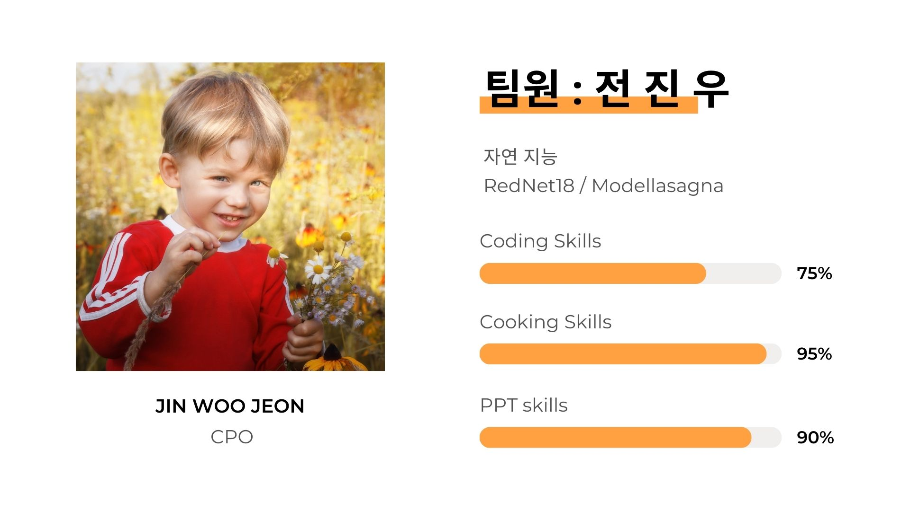

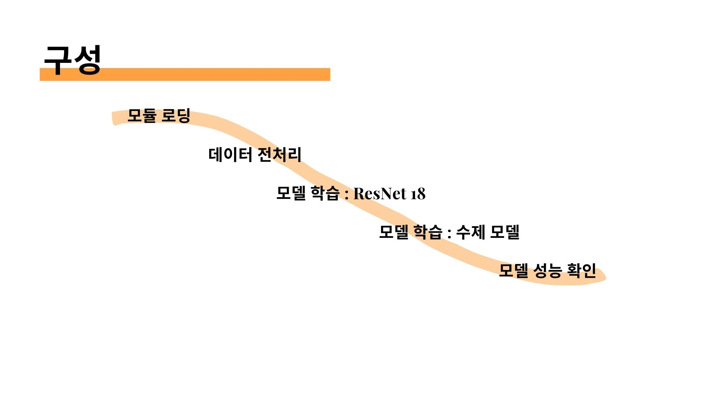

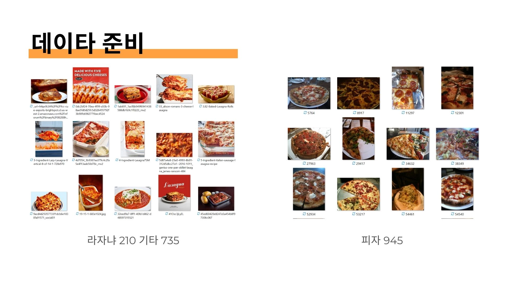
: 피자 945장, 피자 외 945장 (라자냐 210장)

- 라자냐 사진을 가져와 전처리하는 데 시간이 걸렸다.

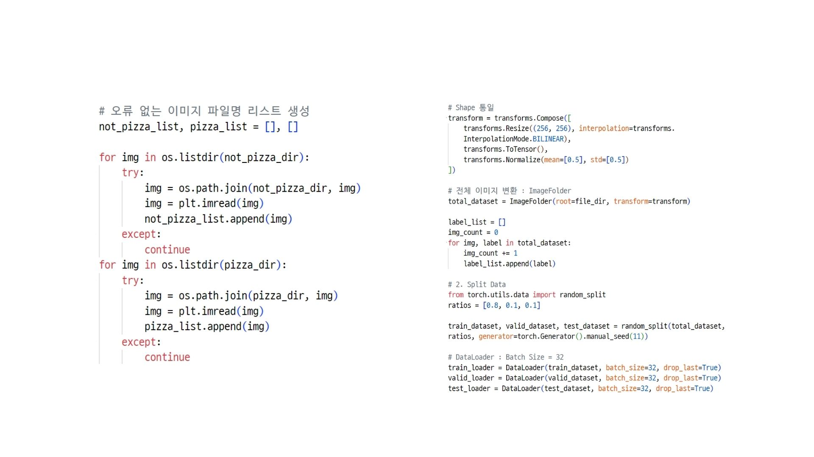
전처리 : 좌) 이미지 오류 제거, 우) 형변환 및 데이터셋 구성

### ResNet18

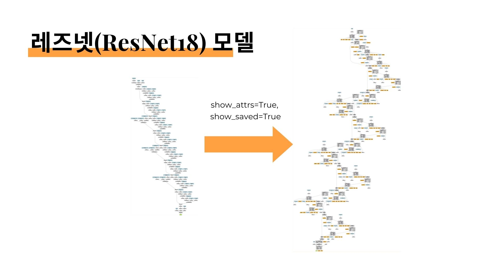
: 레즈넷 모델 사용 : 모델 분석 (make_dot)

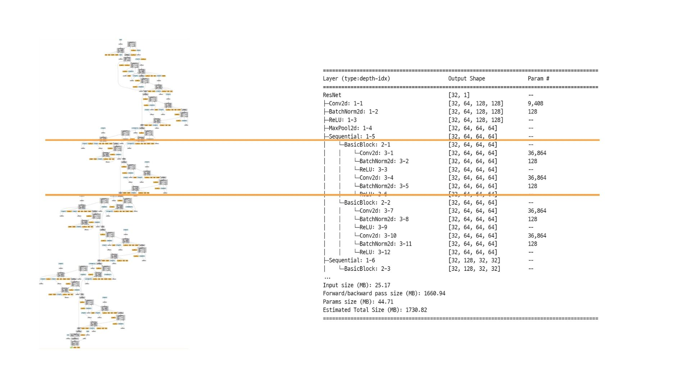
: 레즈넷 모델 사용 : 모델 분석 (summary)

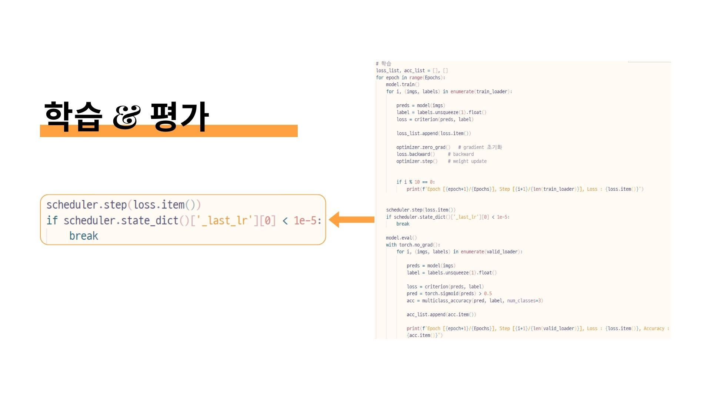
: 학습 및 평가 - 스케쥴러 사용

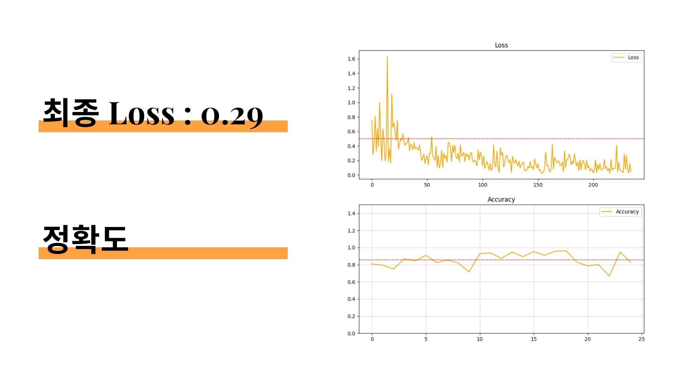
: 성적이 나쁘지 않았다.

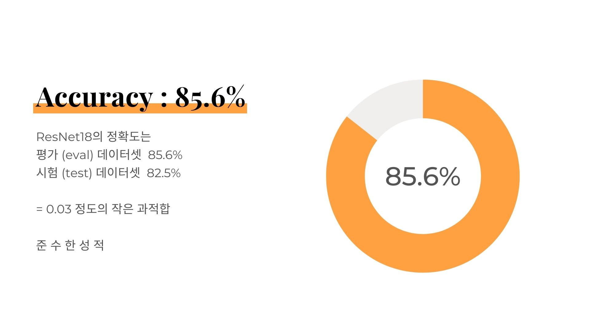
: 최종 정확도 : 85.6%

### 수제 모델 ModelLasagna

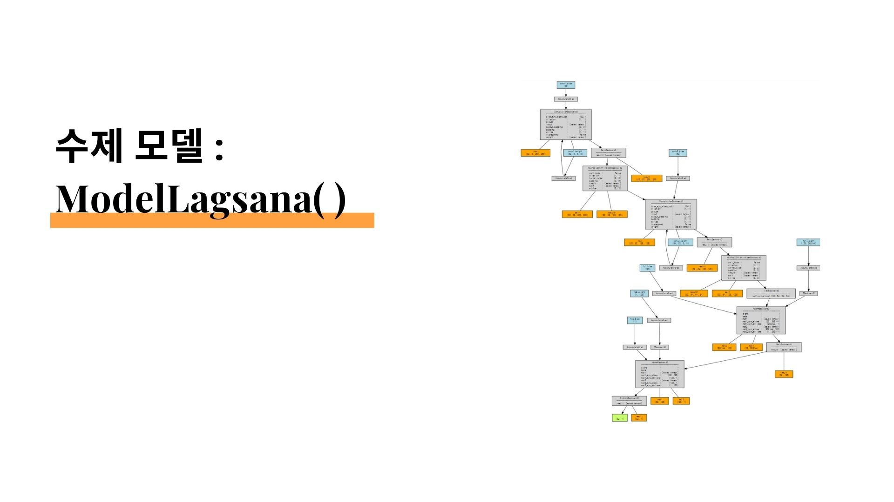
: ModelLasagna( ) - make_dot

: ModelLasagna( ) - Summary

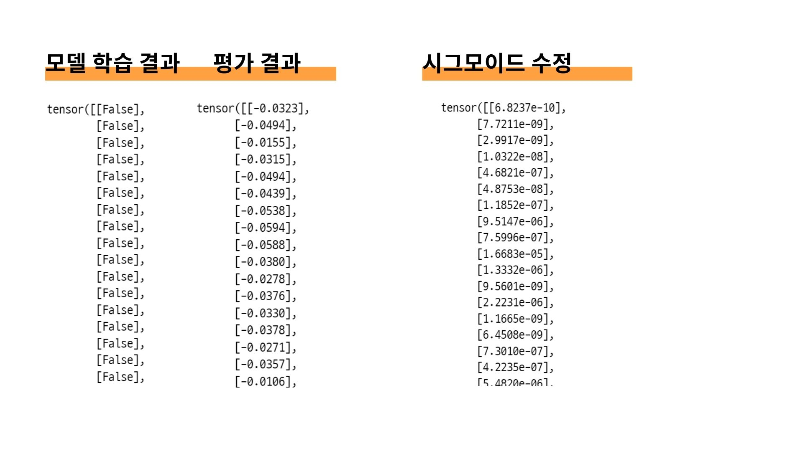
: 학습 및 평가 - 결과값이 너무 낮다 (?? 음수도 있었네 ??)  
: 시그모이드 함수를 수정했는데도 여전한 문제

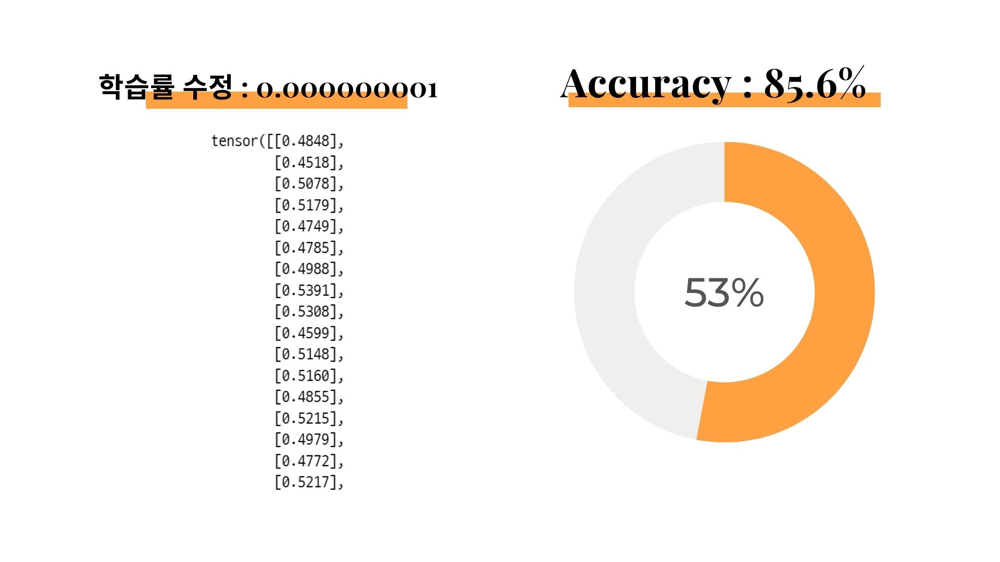
: 하지만 학습률을 0.001에서 0.000000001까지 바꿔본 결과  
: 0.5에 가깝고 0.5 정도의 정확도를 보이는 것을 확인 (사실 거의 무의미한 수치)
