# KDT5_OpenCV_Project

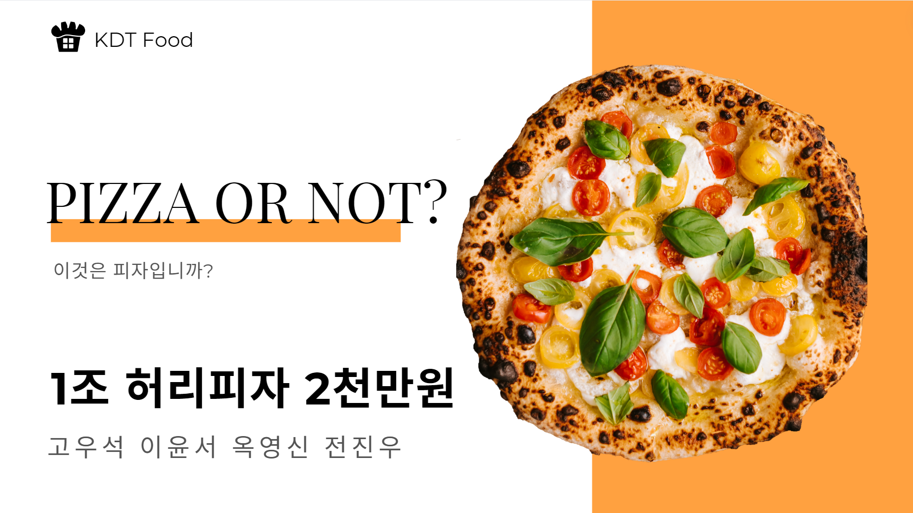

## 주제 : 피자 낫피자

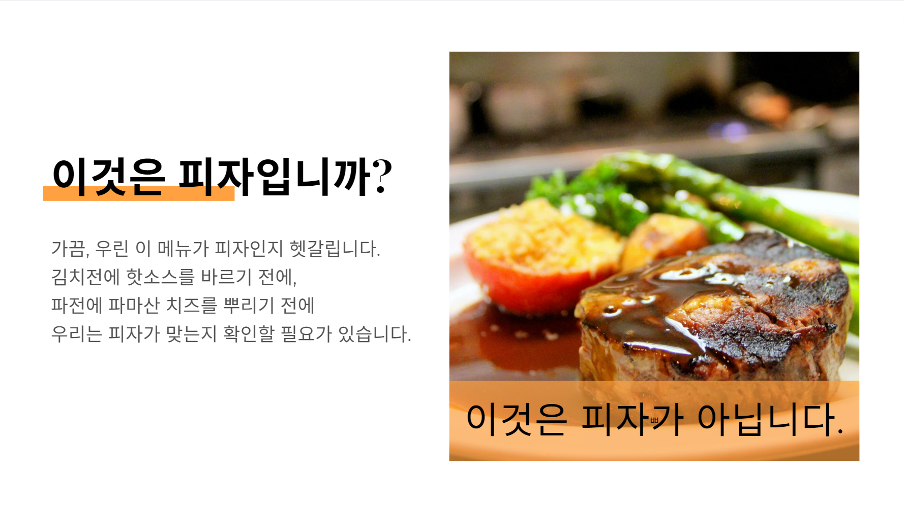

## 팀원

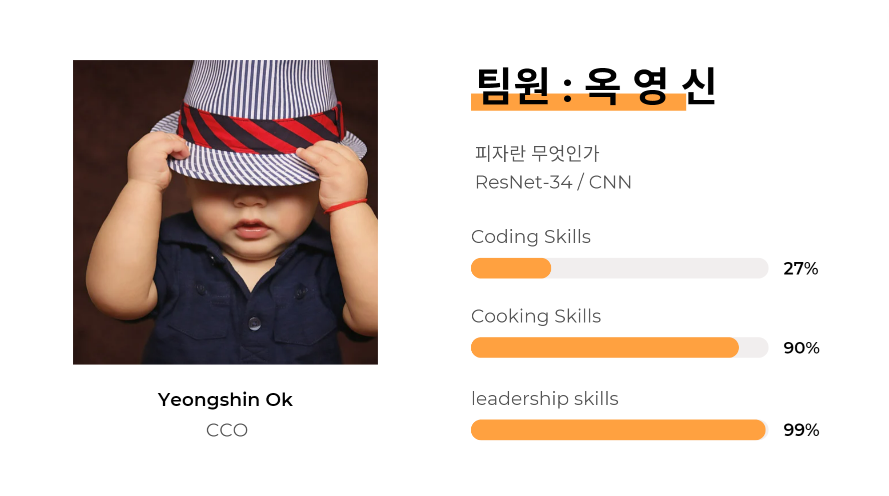
[**YOUNG_SHIN_OK**](/OYS/)

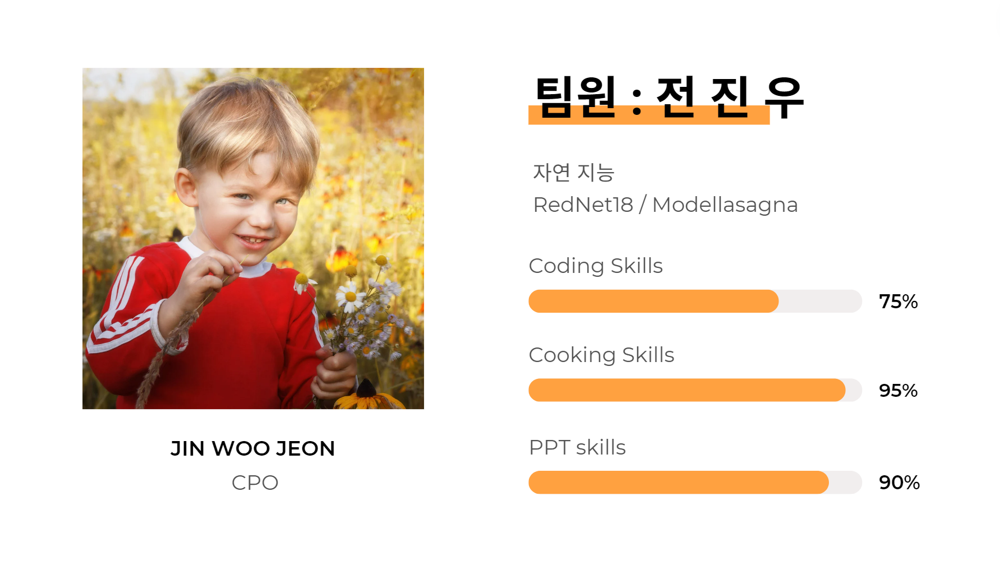
[**JIN_WOO_JEON**](/JJW/)

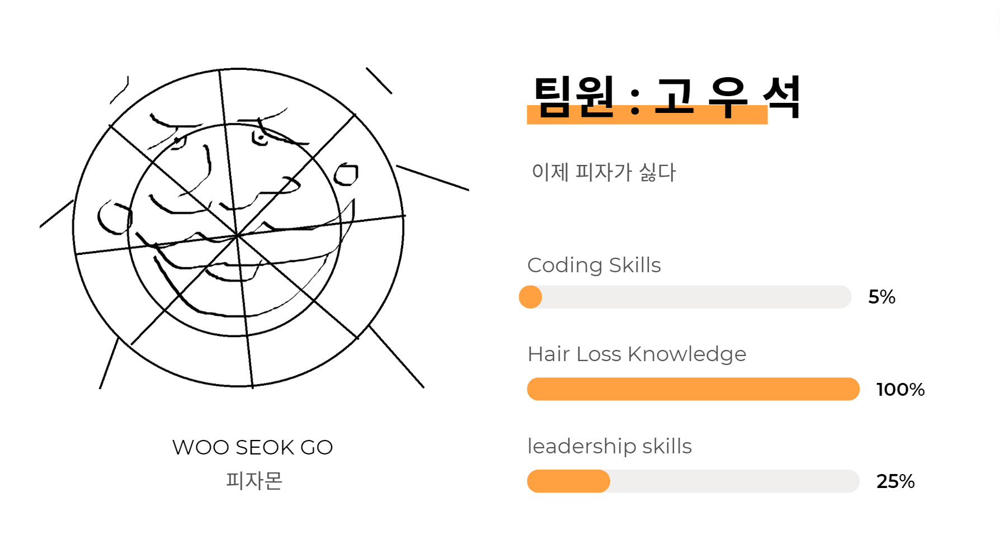
[**WOO_SEOK_GO**](/KWS/)

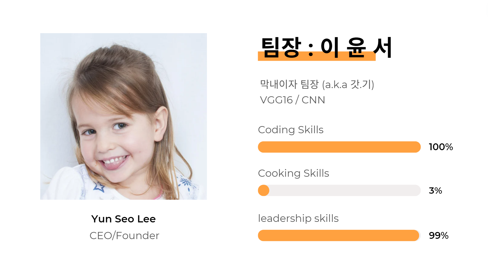
[**YUN_SEO_LEE**](/LYS/)

## 결과

김치전 : 피자
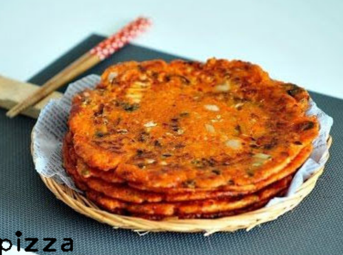

오꼬노미야끼 : 낫 피자
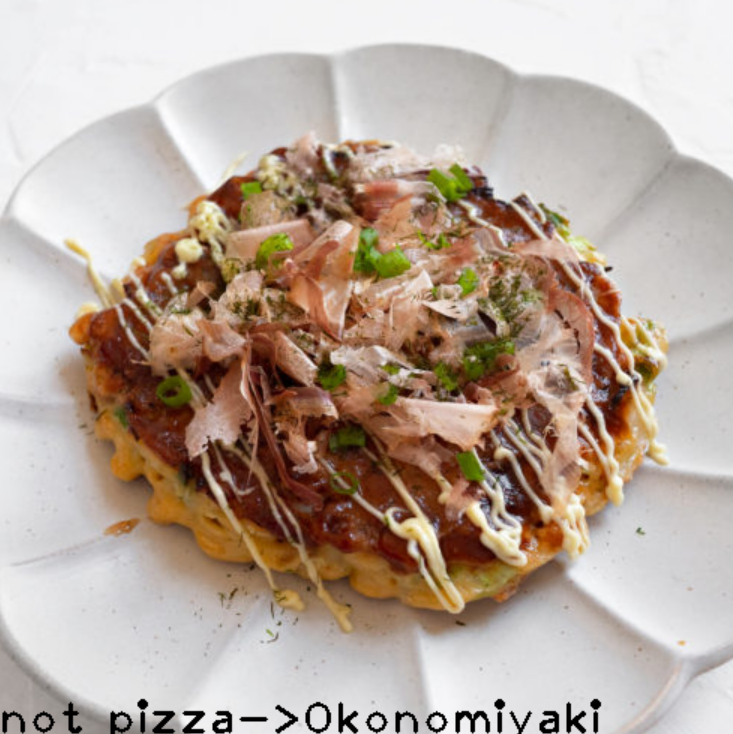

파전 : 낫 피자

사과 : 낫 피자
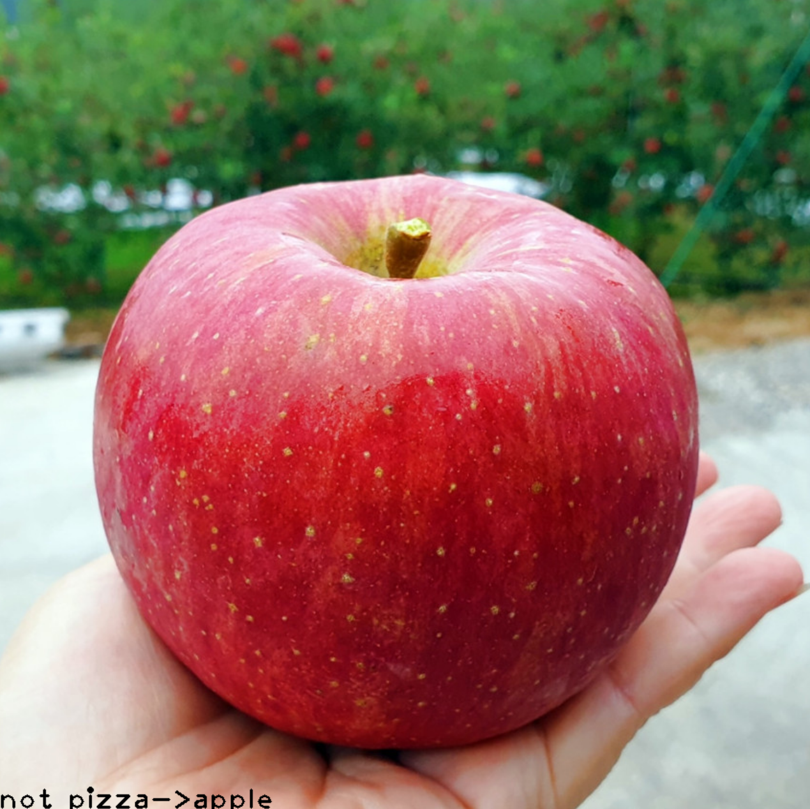

소고기 : 피자

라자냐 : 피자
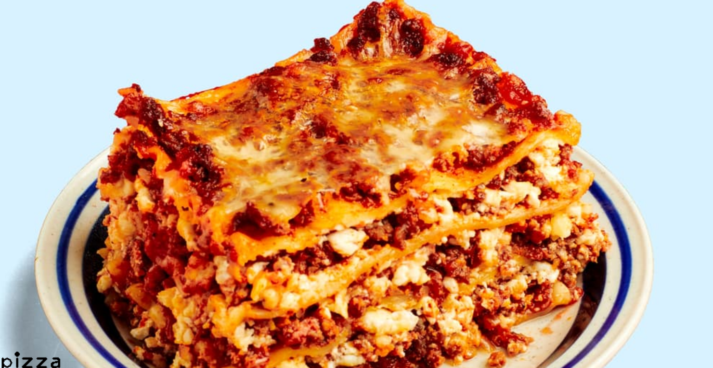

피자는 잘 나옴
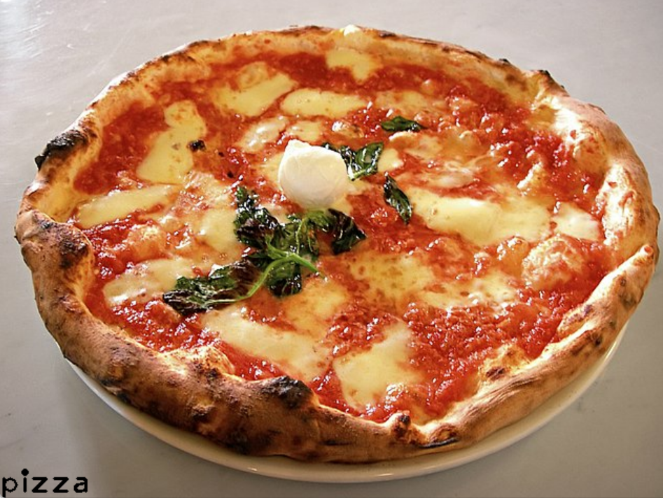
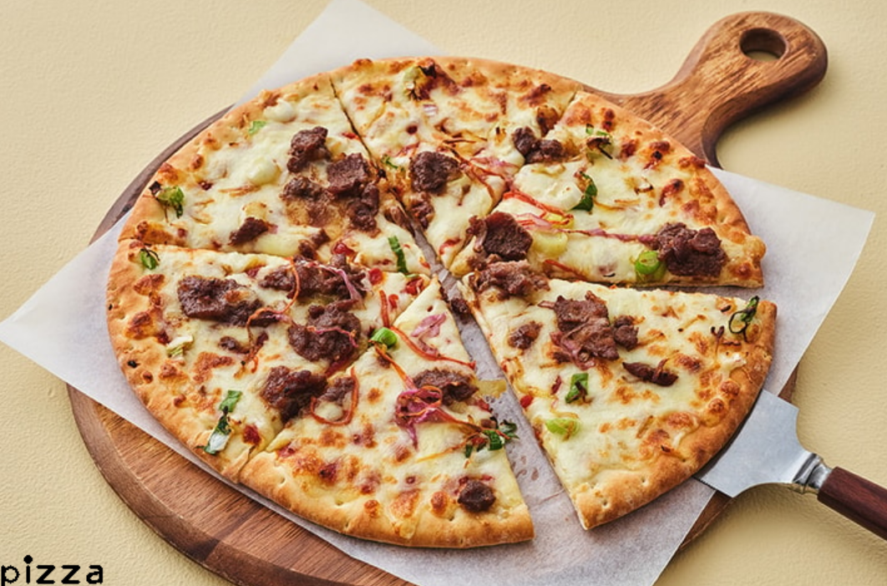